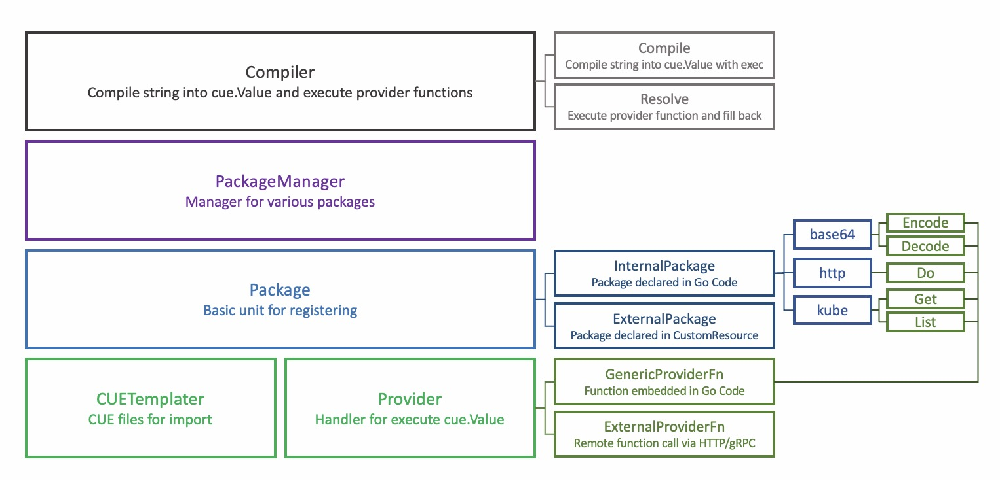

# CueX: Extended CUE Compiler

## Background

In native [CUE](https://cuelang.org/), although there are functions that could be used in cue string to render values with underlying implementations, it is not easy to make extensions to those functions.

```cue
// example.cue
import "strings"

x: "aaa"
y: strings.ToUpper(x)
```

In addition to that, CUE's function are designed for idempotent execution, in other word, with the same input, the output of CUE functions are fixed.

## Goal

However, there are times that user may want to extend the render capability of CUE by integrating customized function implementations. 

The aim of CueX is to build a light engine for reach that goal.

## Arch



### Resolve Process

To allow users make extension to the native CUE rendering process, CueX uses a customized **Compiler** to do the *Resolve* work. It recursively loops over all the CUE values and find out struct as
```cue
{
  #do: string
  #provider: string

  $params: {
    ...
  }

  $returns: {
    ...
  }
}
```

It will search for the **ProviderFn** (specified by #do) in the given **Provider** and call the function. Note that every schema should have `params` and `returns`. CueX will execute the **ProviderFn** with `$params` value as inputs, then it will fill back the result to `$returns` after execution. In this way, it is possible to define customized functions for either rendering or pure executing.

Each time a **ProviderFn** is called, the **Compiler** will repeat the *Resolve* work after the result of last execution is filled back. Executed CUE values will not be executed again in the later process. The repeated `Resolve` stops when no more CUE values that needs to be run.

To help CUE users recognize the input and output scheme for the function call, there is **CUETemplater** aside by the **Provider** that holds CUE definition for the provider function. Like [http.cue](./providers/http/http.cue). It also defines the import path for use when user want to reference it.

```cue
import "vela/http"

req: http.#Get & {
  $params: {
    url: "https://cuelang.org"
  }
}

body: req.$returns.body
```

**CUETemplater** and **Provider** together compose **Package**, the basic unit for registering and discovery. By far, internal implementation of **Package** includes `base64`, `http`, `kube`, etc. **Packages** are managed in **PackageManager** which gives unified interface for access.

### External Imports

In the case user wants to make integration, there is also a Kubernetes CustomResource defined as [packages.cue.oam.dev](../../crds/cuex.oam.dev_packages.yaml). By building server and host it somewhere, you can register it as a **Provider** in **Package**.

For example, if you want to register a external package to provide mysql access in CUE, you can create a CustomResource in your Kubernetes cluster as

```yaml
apiVersion: cue.oam.dev/v1alpha1
kind: Package
metadata:
  name: mysql
spec:
  path: ext/db/mysql
  provider:
    protocol: http
    endpoint: https://my-render-server/mysql
  templates:
    mysql.cue: |
      package mysql
      #Table: {
        name: string
      }
      #ListTables: {
        #do: "list-tables"
        #provider: "mysql"
        $params: {
          conn: string
          db: string
        }
        $returns: [...#Table]
      }
      ...
```

By default, **PackageManager** only loads internal packages. There are functions for it to load external packages:
1. *LoadExternalPackages*: Load Packages from CustomResource in the target cluster at once.
2. *ListenExternalPackages*: Watch CustomResource Package changes in the target cluster.

In the case that CueX only need to execute once, it is recommended to use the first option, (like Vela CLI). In other cases that updates are always needed (like Controller or WebServer), the second option is recommended.